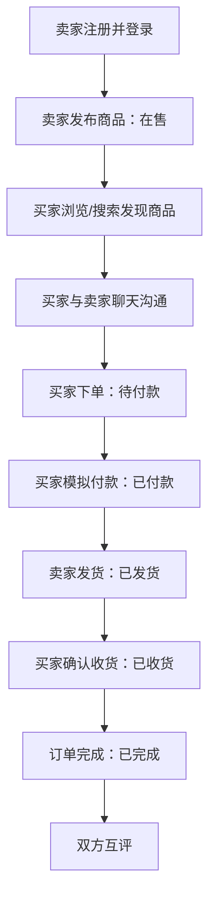
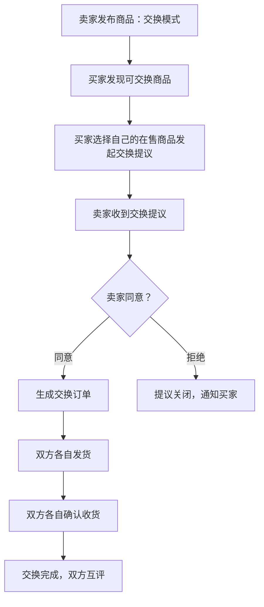

# 二手交易平台 产品需求文档（PRD）

| 项目 | 内容 |
| --- | --- |
| 文档版本 | v1.1（增加以物易物功能，技术栈调整为 Vue.js + MySQL） |
| 产品阶段 | 最小可行产品（MVP）规划 |
| 编制依据 | 《二手交易平台-产品与技术规范头脑风暴过程》 |
| 当前状态 | 待确认 |
| 编制日期 | 2026-07-08 |

## 1. 文档目的

本文档定义二手交易平台（类似闲鱼）最小可行产品（MVP）的产品目标、服务对象、角色价值、功能范围、核心流程、版本边界、验收目标及后续迭代路线。其用途是统一产品理解，为后续编制软件需求规格说明书（SRS）、页面与交互说明、技术设计和实施计划提供产品层依据。

本文档不展开字段长度、接口参数、存储结构、详细异常处理、页面控件规则或测试用例等实现级内容；这些内容应在后续专项文档中细化并确认。

## 2. 产品概述

### 2.1 产品背景

当前缺乏一个统一的 C2C 闲置物品交易平台，买卖双方只能通过分散的社交渠道发布和寻找二手商品，交易过程缺乏担保机制、沟通记录和评价体系。MVP 面向个人用户的简单二手交易场景，先以可运行、可演示、可验证的闭环系统替代分散或不可追踪的线下交易方式。

### 2.2 产品定位

本产品是一套 C2C 个人对个人的闲置物品交易平台。所有注册用户均可作为买家浏览、购买商品，也可作为卖家发布、管理商品。平台提供商品展示、站内聊天、担保交易（模拟支付）、以物易物和基础评价功能。产品首期服务于小规模本地演示和试用，不以生产级规模和完整电商运营能力为目标。

### 2.3 产品愿景

先建立从商品发布、即时沟通到担保交易/以物易物完成的完整闭环，再基于真实使用数据逐步接入真实支付、物流追踪和智能推荐，最终演进为可正式运营的 C2C 二手交易平台。

## 3. 产品目标与非目标

### 3.1 MVP 目标

| 编号 | 目标 |
| --- | --- |
| G-01 | 为用户提供统一的闲置物品发布、浏览、搜索与购买的在线入口。 |
| G-02 | 使买卖双方能够通过站内实时聊天沟通商品细节和交易条件。 |
| G-03 | 实现平台担保交易流程（模拟支付），覆盖下单、发货、收货、完成闭环。 |
| G-04 | 实现以物易物流程，用户可发布可交换商品并发起/接受交换提议，覆盖交换双方确认、发货、收货、完成闭环。 |
| G-05 | 支持订单取消、退款申请和纠纷处理，覆盖交易异常场景。 |
| G-06 | 建立基础评价体系，为后续用户信誉积累提供数据基础。 |
| G-07 | 采用 Vue.js + Spring Boot + MySQL 技术架构，为后续功能迭代和生产部署提供坚实基础。 |

### 3.2 MVP 非目标

MVP 不以以下能力为交付目标：

- 不接入支付宝/微信等真实支付渠道。
- 不接入物流追踪 API。
- 不提供第三方登录（微信/支付宝等）。
- 不提供消息推送/通知服务。
- 不提供首页推荐流、瀑布流或智能推荐算法。
- 不提供高级搜索与多条件筛选。
- 不提供数据统计报表或管理看板。
- 不提供商品页面公开留言/评论区。
- 以物易物 MVP 阶段不支持补差价功能，仅支持等价交换。
- 不以正式生产部署、高并发处理或完善运维能力为目标。

## 4. 目标用户与角色价值

### 4.1 普通用户（买家+卖家）

所有注册用户均同时具备买家与卖家身份。其核心诉求是能够方便地发布闲置物品、浏览和搜索感兴趣的商品、与交易对方实时沟通、在平台担保下完成现金交易或以物易物，并积累交易信誉。

MVP 为普通用户提供：

- 自助注册与基础登录、退出。
- 发布包含完整信息的闲置商品（标题、价格、描述、分类、图片、成色、交易方式、所在地、交易模式）。
- 按分类浏览商品并支持关键词搜索。
- 查看商品详情、卖家信息和评价。
- 通过站内聊天（WebSocket）与卖家/买家实时沟通。
- 下单购买并完成模拟支付的担保交易流程。
- 对标记为可交换的商品发起以物易物提议，并管理交换流程。
- 管理自己在售/已售/已下架的商品。
- 查看买/卖/交换订单列表并按状态管理。
- 交易完成后对交易对方进行星级评价。
- 查看个人主页（含基本信息、在售商品、评价评分）。

### 4.2 管理员

管理员为平台运营与纠纷处理负责人。其核心诉求是维护平台基础秩序、管理用户和分类、处理交易纠纷。

MVP 为管理员提供：

- 初始化管理员身份后登录系统。
- 新建、编辑、停用商品分类。
- 查看用户列表，启用/禁用用户账号。
- 查看全平台订单。
- 查看争议订单详情并做出纠纷裁定。

## 5. 核心使用场景

### 5.1 卖家发布闲置物品

卖家注册并登录后，选择分类、填写标题、价格、描述，上传图片，设定成色、交易方式和所在地，发布商品。系统创建一条状态为"在售"的商品记录，该商品出现在首页和分类页的商品列表中。

### 5.2 买家浏览并购买

买家登录后通过首页浏览最新商品或选择分类筛选，也可使用关键词搜索。找到感兴趣的商品后进入详情页查看完整信息和卖家评价，通过聊天与卖家沟通细节。决定购买后点击"立即购买"创建订单。

### 5.3 担保交易流程

买家下单后订单进入"待付款"状态；买家模拟付款后订单变为"已付款"；卖家发货并填写物流信息后订单变为"已发货"；买家确认收货后订单变为"已收货"；系统自动完成或双方确认后订单变为"已完成"，双方可互评。

### 5.4 交易异常处理

待付款时买家可取消订单；已付款后买家可申请取消或卖家主动取消（未发货时）；已收货后买家可申请退款；退款争议由管理员介入裁定。

### 5.5 管理员维护秩序

管理员可维护商品分类，启用/禁用违规用户账号，裁定交易纠纷。

### 5.6 以物易物流程

卖家发布商品时可将交易模式设置为"交换"或"两者均可"。买家看到可交换商品后，可从自己发布的在售商品中选择一件作为交换物，发起交换提议并附上交换意向说明。卖家收到提议后查看买家的交换商品和说明，选择同意或拒绝。卖家同意后生成交换订单，双方各自发货、各自确认收货后交换完成。

## 6. MVP 功能需求

### 6.1 账号与身份认证

| 编号 | 功能需求 | 适用角色 | 优先级 |
| --- | --- | --- | --- |
| FR-AUTH-01 | 系统应允许用户通过用户名和密码开放注册。 | 普通用户 | 必须 |
| FR-AUTH-02 | 系统应允许用户和管理员通过账号及密码登录，并支持退出。 | 全部角色 | 必须 |
| FR-AUTH-03 | 系统应支持初始化管理员，以开展首次配置和用户管理。 | 管理员 | 必须 |
| FR-AUTH-04 | 管理员不应开放注册，仅可通过系统初始化创建。 | 管理员 | 必须 |
| FR-AUTH-05 | 系统应允许管理员查看用户列表，并禁用或启用用户账号。 | 管理员 | 必须 |
| FR-AUTH-06 | 被禁用用户不得继续登录、发布商品或发起聊天，其历史数据应保留。 | 普通用户、管理员 | 必须 |

### 6.2 商品分类管理

| 编号 | 功能需求 | 适用角色 | 优先级 |
| --- | --- | --- | --- |
| FR-CAT-01 | 系统应预设若干商品大类（如数码、服饰、家居、图书等）。 | 系统 | 必须 |
| FR-CAT-02 | 系统应允许管理员新增、编辑或停用商品一级分类。 | 管理员 | 必须 |
| FR-CAT-03 | 卖家发布商品时应从有效分类中选择，并可添加自定义标签。 | 普通用户 | 必须 |

### 6.3 商品发布与管理

| 编号 | 功能需求 | 适用角色 | 优先级 |
| --- | --- | --- | --- |
| FR-PRD-01 | 卖家应能发布包含标题、价格、描述、分类、图片、成色、交易方式、所在地、交易模式（出售/交换/两者均可）的商品。 | 普通用户 | 必须 |
| FR-PRD-02 | 新发布的商品默认状态为"在售"，每个商品为单库存（一件）。 | 普通用户 | 必须 |
| FR-PRD-03 | 卖家应能查看和管理自己发布的商品（在售/已售/已下架）。 | 普通用户 | 必须 |
| FR-PRD-04 | 卖家应能主动下架在售商品。 | 普通用户 | 必须 |
| FR-PRD-05 | 商品被购买后系统应自动将状态变更为"已售"。 | 系统 | 必须 |

### 6.4 商品浏览与搜索

| 编号 | 功能需求 | 适用角色 | 优先级 |
| --- | --- | --- | --- |
| FR-BRW-01 | 首页应展示最新发布的在售商品列表。 | 普通用户 | 必须 |
| FR-BRW-02 | 用户应能按商品分类筛选商品，支持按最新或价格排序。 | 普通用户 | 必须 |
| FR-BRW-03 | 用户应能通过关键词搜索商品标题和描述。 | 普通用户 | 必须 |
| FR-BRW-04 | 用户应能进入商品详情页查看完整信息、卖家信息和评价。 | 普通用户 | 必须 |

### 6.5 站内聊天

| 编号 | 功能需求 | 适用角色 | 优先级 |
| --- | --- | --- | --- |
| FR-CHT-01 | 买卖双方应能通过 WebSocket 实时聊天进行一对一私密沟通。 | 普通用户 | 必须 |
| FR-CHT-02 | 聊天入口应从商品详情页或订单详情页发起。 | 普通用户 | 必须 |
| FR-CHT-03 | 用户应能看到联系人列表和历史聊天记录。 | 普通用户 | 必须 |

### 6.6 订单与交易

| 编号 | 功能需求 | 适用角色 | 优先级 |
| --- | --- | --- | --- |
| FR-ORD-01 | 买家应能从商品详情页下单购买，生成订单。 | 普通用户 | 必须 |
| FR-ORD-02 | 订单状态应遵循"待付款→已付款→已发货→已收货→已完成"流程。 | 系统 | 必须 |
| FR-ORD-03 | 买家应能在待付款状态取消订单。 | 普通用户 | 必须 |
| FR-ORD-04 | 买家应能在已付款状态申请取消；卖家在未发货前也可取消。 | 普通用户 | 必须 |
| FR-ORD-05 | 已发货之后不可取消订单。 | 系统 | 必须 |
| FR-ORD-06 | 已收货后买家可申请退款，需卖家同意。 | 普通用户 | 必须 |
| FR-ORD-07 | 支付环节采用模拟支付：点击"付款"即视为已付款。 | 普通用户 | 必须 |
| FR-ORD-08 | 卖家发货时应能填写物流信息或自提说明。 | 普通用户 | 必须 |
| FR-ORD-09 | 用户应能查看自己的买/卖订单列表并按状态筛选。 | 普通用户 | 必须 |

### 6.7 以物易物

| 编号 | 功能需求 | 适用角色 | 优先级 |
| --- | --- | --- | --- |
| FR-BRT-01 | 卖家发布商品时可选择交易模式：出售、交换、两者均可。 | 普通用户 | 必须 |
| FR-BRT-02 | 标记为"交换"或"两者均可"的商品，买家可发起以物易物提议。 | 普通用户 | 必须 |
| FR-BRT-03 | 买家发起交换提议时，须从自己发布的在售商品中选择一件作为交换物，并填写交换意向说明。 | 普通用户 | 必须 |
| FR-BRT-04 | 卖家可查看交换提议（含交换商品详情和意向说明），选择同意或拒绝。 | 普通用户 | 必须 |
| FR-BRT-05 | 卖家同意后生成交换订单，双方各自按约定发货。 | 系统 | 必须 |
| FR-BRT-06 | 双方各自确认收货后交换完成，双方可互评。 | 普通用户 | 必须 |
| FR-BRT-07 | MVP 阶段以物易物不支持补差价，仅支持等价交换。 | 系统 | 必须 |

### 6.8 纠纷处理

| 编号 | 功能需求 | 适用角色 | 优先级 |
| --- | --- | --- | --- |
| FR-DSP-01 | 退款争议应由管理员查看买卖双方陈述后做出裁定。 | 管理员 | 必须 |
| FR-DSP-02 | 管理员应能查看争议订单的完整信息和沟通记录。 | 管理员 | 必须 |

### 6.8 评价体系

| 编号 | 功能需求 | 适用角色 | 优先级 |
| --- | --- | --- | --- |
| FR-RTG-01 | 订单完成后，买卖双方应能给对方 1-5 星评分。 | 普通用户 | 必须 |
| FR-RTG-02 | 用户评分应展示在个人主页，作为信誉参考。 | 普通用户 | 必须 |

## 7. 核心业务流程

### 7.1 商品发布与交易主流程

### 7.2 订单状态定义

| 状态 | 产品含义 | 主要操作角色 |
| --- | --- | --- |
| 待付款 | 买家已下单，等待付款。 | 买家 |
| 已付款 | 买家已付款（模拟），等待卖家发货。 | 卖家 |
| 已发货 | 卖家已发货，等待买家确认收货。 | 买家 |
| 已收货 | 买家已收货，等待完成或申请退款。 | 买家、卖家 |
| 已完成 | 交易完成，双方可互评。 | 双方 |
| 已取消 | 订单被取消，交易终止。 | 系统 |

### 7.3 商品状态定义

| 状态 | 产品含义 |
| --- | --- |
| 在售 | 商品正常展示，可被浏览和购买。 |
| 已售 | 商品已被购买，不再展示。 |
| 已下架 | 卖家主动下架，不再公开展示。 |

### 7.4 以物易物流程

### 7.5 交换订单状态定义

| 状态 | 产品含义 |
| --- | --- |
| 待确认 | 买家发起交换提议，等待卖家确认。 |
| 已确认 | 卖家同意交换，等待双方发货。 |
| 双方已发货 | 双方均已发货，等待双方收货。 |
| 已完成 | 双方均确认收货，交换完成。 |
| 已拒绝 | 卖家拒绝交换提议。 |

## 8. 权限范围概览

| 能力 | 普通用户 | 管理员 |
| --- | --- | --- |
| 开放注册 | 可操作 | 不可操作 |
| 登录与退出 | 可操作 | 可操作 |
| 浏览/搜索商品 | 可操作 | 可操作 |
| 发布商品 | 可操作 | 可操作 |
| 管理自己的商品 | 可操作 | 不可操作 |
| 站内聊天 | 可操作 | 可操作 |
| 下单购买 | 可操作 | 可操作 |
| 管理自己的订单 | 可操作 | 不可操作 |
| 取消/退款操作 | 按角色权限 | 不可操作 |
| 发起以物易物提议 | 可操作 | 可操作 |
| 管理交换提议 | 仅自己的商品收到的提议 | 不可操作 |
| 评价 | 仅交易对方 | 仅自己参与的交易 |
| 维护商品分类 | 不可操作 | 可操作 |
| 启用/禁用用户 | 不可操作 | 可操作 |
| 查看全平台订单 | 不可操作 | 可操作 |
| 处理纠纷裁定 | 不可操作 | 可操作 |

## 9. 页面范围

### 9.1 用户端

| 页面 | 核心目的 | MVP 包含的能力 |
| --- | --- | --- |
| 注册页 | 创建用户账号 | 用户名 + 密码注册 |
| 登录页 | 进入系统 | 用户名 + 密码登录，退出 |
| 首页 | 商品发现入口 | 分类入口、搜索框、最新商品列表 |
| 商品分类页 | 按分类浏览 | 分类筛选、排序（最新/价格） |
| 商品详情页 | 了解商品与卖家 | 图片、信息、卖家信息、联系卖家、发起交换、立即购买 |
| 发布商品页 | 发布闲置物品 | 完整商品信息填写（含交易模式）与图片上传 |
| 我的商品页 | 管理个人商品 | 在售/已售/已下架管理 |
| 我的订单页 | 管理买卖订单 | 订单列表，按状态筛选；含现金和交换订单 |
| 订单详情页 | 跟踪订单进展 | 状态、物流、操作按钮（含现金和交换两种模式） |
| 交换提议页 | 发起以物易物 | 选择自己的在售商品、填写意向说明 |
| 聊天页 | 买卖沟通 | 联系人列表 + 实时对话 |
| 个人主页 | 展示个人信誉 | 基本信息、在售商品、评分 |

### 9.2 管理端

| 页面 | 核心目的 | MVP 包含的能力 |
| --- | --- | --- |
| 用户管理页 | 管理用户访问资格 | 查看列表、启用/禁用 |
| 分类管理页 | 维护商品分类 | 新增、编辑、停用一级分类 |
| 纠纷处理页 | 处理交易争议 | 查看争议订单和陈述，做出裁定 |

## 10. 产品约束与质量要求

### 10.1 业务与范围约束

- 产品面向 C2C 个人对个人交易，不涉及 B2C 商家模式。
- 首期以本地运行和小规模试用为目标，预期注册用户不超过 200 人、同时在售商品不超过 500 件。
- 商品仅使用"固定大类 + 用户自定义标签"体系，不纳入多级分类。
- 每个商品为单库存（一件），售出或交换后自动下架。
- 支付为模拟模式，不涉及真实资金流转。
- 以物易物 MVP 阶段仅支持等价交换，不支持补差价。
- 前端采用 Vue.js 框架，后端采用 Spring Boot + MySQL，前端通过 Vite 构建，由 Spring Boot 或 Nginx 提供静态资源服务。

### 10.2 产品质量底线

| 编号 | 要求 |
| --- | --- |
| QR-01 | 用户只能访问其角色与业务范围允许查看的数据和操作。 |
| QR-02 | 密码不得以明文方式保存。 |
| QR-03 | MySQL 数据库中的数据不得因服务重启丢失。 |
| QR-04 | 订单和交换订单的关键处理过程应可通过状态、操作记录追溯。 |
| QR-05 | 前端应基于 Vue.js 组件化开发，后端应基于 Spring Boot 分层架构，使用 JPA 操作 MySQL 数据库。 |

## 11. MVP 验收目标

MVP 应通过可演示的完整业务路径证明产品闭环成立：

| 编号 | 验收目标 |
| --- | --- |
| AC-01 | 用户可以完成注册、登录。 |
| AC-02 | 卖家可以发布包含完整信息（标题、价格、描述、分类、图片、成色、交易方式、所在地、交易模式）的商品。 |
| AC-03 | 买家可以按分类浏览商品、通过关键词搜索商品。 |
| AC-04 | 买家和卖家可以通过 WebSocket 实时聊天沟通。 |
| AC-05 | 买家可以下单并完成模拟付款。 |
| AC-06 | 卖家可以确认发货并填写物流信息。 |
| AC-07 | 买家可以确认收货并完成订单。 |
| AC-08 | 订单支持取消（待付款/已付款阶段）和退款申请（已收货阶段）。 |
| AC-09 | 买家可对标记为可交换的商品发起以物易物提议（选择自己的在售商品 + 填写意向说明）。 |
| AC-10 | 卖家可查看交换提议，选择同意或拒绝；同意后生成交换订单，双方各自发货、各自收货后完成。 |
| AC-11 | 管理员可以介入裁定退款纠纷。 |
| AC-12 | 双方可以在交易/交换完成后互评（1-5 星）。 |
| AC-13 | 管理员可以管理商品分类和用户账号的启用/禁用。 |
| AC-14 | 服务重启后 MySQL 中的业务数据保留。 |
| AC-15 | 密码安全保存、访问权限与关键流程能够通过测试验证。 |

## 12. 后续文档衔接

本 PRD 经确认后，将作为以下文档的产品需求输入：

| 后续文档 | 需要进一步定义的内容 |
| --- | --- |
| 软件需求规格说明书（SRS） | 详细业务规则、字段约束、权限检查、状态转换、异常流程和非功能需求 |
| 页面与交互说明 | 页面结构、操作步骤、导航、反馈提示和界面交互 |
| 技术设计说明书 | 系统模块、认证方式、仓储抽象、持久化、WebSocket 部署和测试策略 |
| 数据模型设计 | 实体字段、标识符、关系和操作记录模型 |
| 接口设计 | 接口路径、请求响应、鉴权规则及错误码 |
| 测试与验收方案 | 可执行的功能、权限、流程、安全和持久化测试用例 |
| MVP 实施计划 | 开发阶段、任务顺序、依赖、里程碑和交付物 |

## 13. 确认记录

| 日期 | 确认人 | 结果 | 备注 |
| --- | --- | --- | --- |
| 待确认 | 用户 | 待确认 | 本文档可作为后续软件需求规格说明书（SRS）及相关设计文档的产品基线。 |
