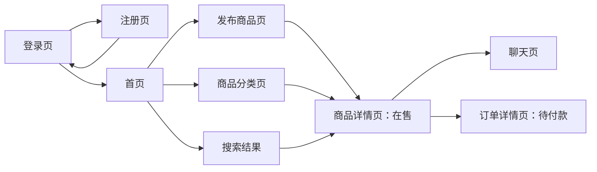
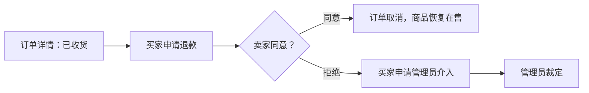
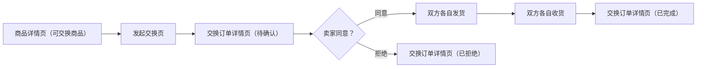
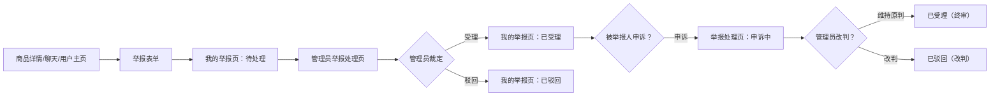

# 二手交易平台 页面与交互说明

| 项目 | 内容 |
| --- | --- |
| 文档版本 | v1.3（补充搜索结果页、退款中状态展示、交换订单操作矩阵完善、会话失效规则、举报功能等） |
| 适用版本 | 最小可行产品（MVP） |
| 文档性质 | 需求级页面与交互说明 |
| 编制依据 | 《二手交易平台 产品需求文档（PRD）v1.0》、《二手交易平台 软件需求规格说明书（SRS）v1.0》 |
| 当前状态 | 待确认 |
| 编制日期 | 2026-07-08 |

## 1. 文档目的与范围

本文档定义最小可行产品（MVP）中用户端与管理端的页面结构、访问角色、页面间导航、展示信息、操作入口、输入反馈、权限表现和关键业务场景的交互结果。本文档旨在将已确认需求转换为可理解、可评审和可进一步设计的界面交互要求。

本文档不定义视觉品牌、颜色字体、像素级排版、响应式布局细节、前端文件结构、接口地址或实现技术方案。

## 2. 交互设计原则

| 编号 | 原则 | 说明 |
| --- | --- | --- |
| UI-P01 | 角色清晰 | 登录后应让用户明确当前身份；用户端与管理端入口不得混淆。 |
| UI-P02 | 操作与权限一致 | 页面只向用户呈现其可能执行的主要操作；后端仍负责最终权限校验。 |
| UI-P03 | 流程可理解 | 商品和订单的当前状态、下一步可执行操作和处理结果应清晰展示。 |
| UI-P04 | 反馈及时 | 发布、购买、发货、收货、评价及管理操作完成或失败后，应提供明确反馈。 |
| UI-P05 | 防止误操作 | 下架商品、取消订单、确认收货、关闭交易等影响较大的操作，应在执行前提示确认。 |
| UI-P06 | 实时通信 | 聊天页应基于 WebSocket 实现实时消息收发，无需手动刷新。 |
| UI-P07 | 保持 MVP 简洁 | 不引入推荐流、通知、统计、复杂筛选或未纳入需求基线的交互入口。 |

## 3. 信息架构与角色入口

### 3.1 页面清单

| 页面编号 | 页面名称 | 访问角色 | 主要用途 |
| --- | --- | --- | --- |
| UI-PUB-01 | 登录页 | 未登录用户 | 统一身份登录入口 |
| UI-PUB-02 | 注册页 | 未登录用户 | 创建用户账号 |
| UI-USER-01 | 首页 | 全部 | 商品分类入口、搜索、最新商品 |
| UI-USER-02 | 商品分类页 | 全部 | 按分类浏览商品 |
| UI-USER-02B | 搜索结果页 | 全部 | 展示关键词搜索结果 |
| UI-USER-03 | 商品详情页 | 全部 | 查看商品信息、卖家信息，联系卖家或立即购买 |
| UI-USER-04 | 发布商品页 | 普通用户 | 发布闲置物品 |
| UI-USER-05 | 我的商品页 | 普通用户 | 管理自己发布的商品 |
| UI-USER-06 | 我的订单页 | 普通用户 | 管理买/卖/交换订单 |
| UI-USER-07 | 订单详情页 | 普通用户 | 查看订单状态与操作（含现金和交换订单） |
| UI-USER-08 | 聊天页 | 普通用户 | 联系人列表 + 实时对话 |
| UI-USER-09 | 个人主页 | 全部 | 查看用户信息、在售商品、评价 |
| UI-USER-10 | 交换提议页 | 普通用户 | 发起以物易物，选择交换商品 |
| UI-USER-11 | 我的举报页 | 普通用户 | 查看提交的举报记录及处理结果 |
| UI-ADM-01 | 用户管理页 | 管理员 | 查看并启用/禁用用户 |
| UI-ADM-02 | 分类管理页 | 管理员 | 新增、编辑、停用商品分类 |
| UI-ADM-03 | 纠纷处理页 | 管理员 | 查看争议订单并做出裁定 |
| UI-ADM-04 | 举报处理页 | 管理员 | 查看举报列表、处理举报、审查申诉 |

### 3.2 登录后导航

| 登录角色 | 登录成功落地页 | 可见主导航 |
| --- | --- | --- |
| 普通用户 | 首页 | 首页、发布商品、我的商品、我的订单、聊天、个人主页、我的举报、退出 |
| 管理员 | 首页 | 首页、聊天、用户管理、分类管理、纠纷处理、举报处理、退出 |

### 3.3 页面访问规则

| 场景 | 页面交互结果 |
| --- | --- |
| 未登录用户访问受保护页面 | 引导至登录页，并提示"请先登录后继续操作"。 |
| 普通用户访问管理端页面 | 显示无权限提示，不展示管理数据。 |
| 用户访问不属于自己的订单详情 | 显示无权限或记录不存在提示。 |
| 被禁用用户使用既有登录状态继续访问 | 清除或失效当前 Token，引导至登录页并提示账号不可用。 |
| 用户正在使用中被管理员禁用 | 该用户下一次 API 请求时 Token 验证失败，前端拦截 401/403 响应后清除本地 Token 并引导至登录页，提示"账号已被禁用，如有疑问请联系管理员"。 |

## 4. 全局交互规则

### 4.1 页面通用区域

登录后的页面应包含统一的基础区域：

| 区域 | 展示内容 | 交互要求 |
| --- | --- | --- |
| 页头 | 系统名称"二手交易平台"、当前用户名、退出入口 | 角色以中文显示。 |
| 主导航 | 当前角色可访问的主要模块 | 当前所在模块应可识别；无权限模块不显示入口。 |
| 内容区 | 当前页面标题、主要内容与操作区 | 页面标题应说明用户正在完成的任务。 |
| 反馈区 | 成功、错误或提示信息 | 操作结果应靠近相关表单或在页面明显位置呈现。 |

### 4.2 状态展示规则

#### 商品状态

| 状态 | 展示文字 | 含义提示 |
| --- | --- | --- |
| 在售 | 在售 | 商品正常展示，可被浏览和购买。 |
| 已售 | 已售 | 商品已被购买。 |
| 已下架 | 已下架 | 卖家主动下架，不再公开展示。 |

#### 订单状态

| 状态 | 展示文字 | 含义提示 |
| --- | --- | --- |
| 待付款 | 待付款 | 等待买家付款。 |
| 已付款 | 已付款 | 买家已付款，等待卖家发货。 |
| 已发货 | 已发货 | 卖家已发货，等待买家收货。 |
| 已收货 | 已收货 | 买家已收货，等待完成。 |
| 退款中 | 退款中 | 退款协商未达成，等待管理员裁定。 |
| 已完成 | 已完成 | 交易完成，可评价。 |
| 已取消 | 已取消 | 订单已取消。 |

### 4.3 表单与反馈规则

| 规则编号 | 交互要求 |
| --- | --- |
| UI-G01 | 所有必填字段应具有可识别的必填提示（红色星号或等效标识）。 |
| UI-G02 | 用户提交表单后，前端可进行基础必填和长度校验；后端返回的业务校验结果必须展示给用户。 |
| UI-G03 | 校验失败时应保留用户已输入的非敏感内容，便于修改后再次提交；密码字段可清空。 |
| UI-G04 | 保存类操作成功后应显示成功提示，并更新页面中的最新业务数据。 |
| UI-G05 | 无数据列表应显示明确空状态说明和适用的下一步操作入口。 |
| UI-G06 | 图片上传应支持预览，上传失败时提示原因。 |
| UI-G07 | 用户输入的文本在展示时按普通文本呈现，不执行其中可能包含的脚本或标记。 |

### 4.4 确认交互

以下操作执行前，应要求操作者进行确认：

| 操作 | 触发角色 | 确认提示需表达的影响 |
| --- | --- | --- |
| 下架商品 | 卖家 | 下架后商品不再公开展示，可重新上架。 |
| 取消订单 | 买家/卖家 | 取消后交易终止。 |
| 确认收货 | 买家 | 确认收货后无法退回，请确认已收到货物。 |
| 申请退款 | 买家 | 退款申请将提交给卖家处理。 |
| 禁用用户 | 管理员 | 禁用后用户不能登录或继续操作，历史数据保留。 |
| 停用分类 | 管理员 | 停用后卖家不能使用该分类发布新商品，已有商品不受影响。 |
| 发起退款申请 | 买家 | 退款申请将提交给卖家处理，请描述退款原因。 |
| 同意交换 | 卖家 | 同意后您的商品将下架，请确保按约定发货。 |
| 拒绝交换 | 卖家 | 拒绝后买家的交换提议将关闭，买家可重新发起提议。 |
| 申请取消交换 | 交换双方 | 取消后双方商品将恢复在售，需对方同意。 |

## 5. 公共页面

### 5.1 登录页（UI-PUB-01）

#### 页面目的

为用户和管理员提供统一登录入口，并为未注册用户提供注册跳转。

#### 页面内容

| 区域 | 内容/控件 | 规则 |
| --- | --- | --- |
| 页面标题 | 二手交易平台 - 登录 | 显示系统名称。 |
| 用户名输入框 | 用户名 | 必填。 |
| 密码输入框 | 密码 | 必填；输入内容应遮蔽显示。 |
| 登录按钮 | 登录 | 点击后执行认证。 |
| 注册入口 | 还没有账号？立即注册 | 仅说明用户可注册。 |

#### 交互流程

| 用户操作/结果 | 页面行为 |
| --- | --- |
| 输入为空后提交 | 标识必填字段。 |
| 登录成功 | 根据角色跳转至首页。 |
| 登录失败 | 显示统一提示："用户名或密码错误，或账号不可用"。 |
| 已登录用户打开登录页 | 直接引导至首页。 |

### 5.2 注册页（UI-PUB-02）

#### 页面目的

允许访客创建普通用户账号。

#### 字段与操作

| 字段/操作 | 展示与输入规则 | 错误反馈 |
| --- | --- | --- |
| 用户名 | 必填，3 至 50 个字符；允许中文、英文、数字、下划线、连字符。 | 为空、长度或格式不合法、已存在时提示。 |
| 密码 | 必填，8 至 128 个字符；遮蔽显示。 | 长度不合法时提示。 |
| 确认密码 | 必填；遮蔽显示。 | 与密码不一致时提示。 |
| 注册按钮 | 提交注册 | 成功后提示注册成功，并引导登录。 |
| 返回登录入口 | 已有账号？去登录 | 不保存未提交内容。 |

#### 成功与失败表现

- 注册成功后跳转登录页并显示"注册成功，请登录"提示。
- 因标识冲突或字段校验失败未完成注册时，保留用户名输入，清空密码输入。

## 6. 用户端页面

### 6.1 首页（UI-USER-01）

#### 页面目的

作为用户进入系统的落地页，提供商品分类入口、搜索和最新商品展示。

#### 页面内容

| 区域 | 内容/控件 | 规则 |
| --- | --- | --- |
| 搜索区 | 搜索框 + 搜索按钮 | 输入关键词搜索在售商品。 |
| 分类入口 | 分类名称列表/标签 | 点击进入对应分类页。 |
| 商品列表 | 商品卡片（首图、标题、价格、成色、发布时间） | 最新在售商品，按创建时间倒序。 |
| 空状态 | 暂无在售商品 | 如果是卖家，提示"去发布商品"。 |

#### 交互规则

- 点击商品卡片进入商品详情页。
- 点击分类进入商品分类页。
- 搜索触发商品搜索，跳转搜索结果展示。

### 6.2 商品分类页（UI-USER-02）

#### 页面目的

按分类浏览在售商品，支持排序。

#### 页面内容

| 区域 | 内容/控件 | 规则 |
| --- | --- | --- |
| 分类标签 | 当前分类名称 | 高亮当前选中分类。 |
| 排序控件 | 最新、价格升序、价格降序 | 默认按最新排序。 |
| 商品列表 | 同首页卡片 | 仅显示当前分类下在售商品。 |
| 空状态 | 该分类暂无商品 | 提示切换分类或浏览其他。 |

### 6.2B 搜索结果页（UI-USER-02B）

#### 页面目的

展示关键词搜索在售商品的结果列表，支持排序。

#### 页面内容

| 区域 | 内容/控件 | 规则 |
| --- | --- | --- |
| 搜索区 | 搜索框（保留当前关键词） + 搜索按钮 | 用户可修改关键词重新搜索。 |
| 结果统计 | "找到 N 件商品" | 显示匹配数量。 |
| 排序控件 | 最新、价格升序、价格降序 | 默认按最新排序。 |
| 商品列表 | 同首页卡片 | 仅显示匹配的在售商品；关键词高亮（如有条件）。 |
| 空状态 | 未找到相关商品 | 提示"未找到与'xxx'相关的商品，换个关键词试试吧"。 |

#### 交互规则

- 从首页搜索框或页头搜索框输入关键词后跳转至本页。
- 修改关键词后重新搜索，更新结果列表。
- 点击商品卡片进入商品详情页。
- 搜索结果默认按创建时间倒序排列。

### 6.3 商品详情页（UI-USER-03）

#### 页面目的

展示商品完整信息，提供联系卖家和立即购买入口。

#### 页面内容

| 区域 | 展示信息/操作 | 规则 |
| --- | --- | --- |
| 商品图片区 | 商品图片（支持多张切换） | 首张为主图。 |
| 商品信息 | 标题、价格、成色、交易方式、所在地、发布时间 | 只读。 |
| 商品描述 | 卖家描述内容 | 按普通文本显示。 |
| 商品标签 | 自定义标签 | 如有。 |
| 卖家信息 | 用户名、平均评分、在售商品数 | 点击可进入卖家个人主页。 |
| 操作按钮 | 联系卖家、立即购买 | 卖家本人不显示购买按钮。 |

#### 交互规则

| 场景 | 页面表现 |
| --- | --- |
| 点击"联系卖家" | 进入聊天页，自动创建或定位与卖家的会话。 |
| 点击"立即购买" | 下单并跳转至订单详情页。 |
| 商品状态不是"在售"时 | 操作按钮隐藏或禁用，显示当前状态。 |
| 卖家本人查看 | 不显示"联系卖家"和"立即购买"，可显示"编辑"或"下架"入口。 |
| 非卖家本人查看 | 显示"举报"按钮入口，点击进入举报表单（举报对象：商品）。 |

### 6.4 发布商品页（UI-USER-04）

#### 页面目的

让卖家发布闲置物品。

#### 页面字段

| 字段/操作 | 展示与输入规则 | 反馈规则 |
| --- | --- | --- |
| 商品分类 | 下拉选择，仅显示有效分类 | 无有效分类时提示暂无法发布。 |
| 标题 | 必填，1 至 100 个字符 | 为空或超长时提示。 |
| 价格 | 必填，数字输入，最多两位小数 | 为 0 或负数时提示。 |
| 描述 | 必填，多行文本，1 至 4000 个字符 | 为空或超长时提示。 |
| 成色 | 必选单选：全新/几乎全新/有使用痕迹 | 未选时提示。 |
| 交易方式 | 必选：自提/快递/两者均可 | 未选时提示。 |
| 所在地 | 必填，1 至 50 个字符 | 为空时提示。 |
| 图片上传 | 最多 3 张，支持 jpg/png/gif，单张 ≤5MB | 超限提示；上传后预览。 |
| 标签 | 可选，逗号分隔，最多 5 个，每个 ≤20 字符 | 超限提示。 |
| 发布按钮 | 提交 | 成功后跳转商品详情页。 |
| 取消按钮 | 返回首页 | 不保存未提交内容。 |

### 6.5 我的商品页（UI-USER-05）

#### 页面目的

让卖家管理自己发布的商品。

#### 页面内容

| 区域 | 内容/控件 | 规则 |
| --- | --- | --- |
| 状态筛选 | 全部、在售、已售、已下架 | 默认全部。 |
| 商品列表 | 首图、标题、价格、状态、发布时间 | 点击进入商品详情。 |
| 操作 | 在售商品显示"下架"按钮 | 成功后状态更新。 |
| 空状态 | 暂无发布的商品 | 提供"发布商品"入口。 |

### 6.6 我的订单页（UI-USER-06）

#### 页面目的

让用户管理自己的买卖订单。

#### 页面内容

| 区域 | 内容/控件 | 规则 |
| --- | --- | --- |
| 角色切换 | 我买的 / 我卖的 | 切换买家/卖家视角。 |
| 状态筛选 | 全部、待付款、已付款、已发货、已收货、已完成、已取消 | 默认全部。 |
| 订单列表 | 商品首图、标题、金额、状态、交易对方、时间 | 点击进入订单详情。 |
| 空状态 | 暂无相关订单 | 提供"去逛逛"入口。 |

### 6.7 订单详情页（UI-USER-07）

#### 页面目的

展示订单完整信息和状态，提供当前状态下的可执行操作。

#### 页面内容

| 区域 | 展示内容 | 角色相关 |
| --- | --- | --- |
| 订单概要 | 订单编号、商品信息（图片/标题/价格）、交易对方、当前状态、金额、创建时间 | 双方可见 |
| 商品信息 | 链接到商品详情 | 双方可见 |
| 物流信息 | 物流单号/自提说明（如有） | 已发货后可见 |
| 操作区 | 根据角色和状态显示对应按钮 | 动态变化 |
| 操作记录 | 状态变更时间线 | 双方可见 |

#### 操作按钮矩阵

| 当前状态 | 买家可见操作 | 卖家可见操作 |
| --- | --- | --- |
| 待付款 | 付款、取消订单 | 无（等待买家付款） |
| 已付款 | 申请取消 | 确认发货、取消订单 |
| 已发货 | 确认收货 | 无（等待买家收货） |
| 已收货 | 申请退款 | 无（等待完成） |
| 退款中 | 无（等待管理员裁定） | 无（等待管理员裁定） |
| 已完成 | 评价对方 | 评价对方 |
| 已取消 | 无 | 无 |

#### 交互规则

| 场景 | 页面表现 |
| --- | --- |
| 点击"付款" | 模拟支付成功，状态变为已付款。 |
| 点击"确认发货" | 弹出物流/自提信息填写框，提交后状态变为已发货。 |
| 点击"确认收货" | 二次确认后状态变为已收货。 |
| 点击"取消订单" | 二次确认后状态变为已取消，商品恢复在售。 |
| 点击"申请退款" | 弹出退款原因填写框，提交后通知卖家。 |
| 点击"评价" | 弹出 1-5 星评分选择，提交后记录。 |

### 6.8 聊天页（UI-USER-08）

#### 页面目的

提供买卖双方 WebSocket 实时一对一沟通。

#### 页面内容

| 区域 | 展示内容 | 规则 |
| --- | --- | --- |
| 联系人列表 | 联系人用户名、最后一条消息、时间、未读标记 | 按最后消息时间倒序。 |
| 对话窗口 | 消息列表 + 输入框 + 发送按钮 | 消息按时间正序展示，实时收发。 |
| 关联信息 | 关联商品/订单链接（如有） | 方便快速查看上下文。 |
| 消息操作 | 每条消息旁显示"举报"入口 | 用户可举报对方发送的违规消息。 |
| 空状态 | 暂无聊天记录 | 提示从商品详情发起聊天。 |

#### 交互规则

| 场景 | 页面表现 |
| --- | --- |
| 发送消息 | WebSocket 实时发送，输入框清空。 |
| 收到新消息 | 实时展示，当前对话窗口自动滚动到底部。 |
| 切换到其他联系人 | 对话窗口切换为对应消息记录。 |

### 6.9 个人主页（UI-USER-09）

#### 页面目的

展示用户公开信息和信誉。

#### 页面内容

| 区域 | 展示内容 | 规则 |
| --- | --- | --- |
| 用户信息 | 用户名、注册时间 | 公开信息。 |
| 信誉信息 | 平均评分（1-5 星）、评价数量 | 从评价数据计算。 |
| 在售商品 | 该用户当前在售商品列表 | 点击进入商品详情。 |

#### 交互规则

| 场景 | 页面表现 |
| --- | --- |
| 非本人查看 | 显示"举报用户"按钮，点击进入举报表单（举报对象：用户）。 |
| 本人查看 | 不显示举报按钮。 |

### 6.10 交换提议页（UI-USER-10）

#### 页面目的

买家对可交换商品发起以物易物提议，选择自己的在售商品作为交换物。

#### 页面内容

| 区域 | 展示/操作 | 规则 |
| --- | --- | --- |
| 目标商品信息 | 图片、标题、卖家用户名 | 只读，展示要交换的目标商品。 |
| 我的在售商品 | 可选择列表（单选） | 仅显示在售商品，排除已售/已下架。 |
| 意向说明 | 多行文本输入框，可选 | 1 至 500 字符。 |
| 提交按钮 | 发起交换 | 校验后生成交换订单。 |
| 取消按钮 | 返回商品详情 | 不保存。 |

#### 交互规则

| 场景 | 页面表现 |
| --- | --- |
| 无在售商品 | 提示"您暂无在售商品可交换，请先发布商品"。 |
| 提交成功 | 跳转至交换订单详情页，状态为"待确认"。 |
| 卖家拒绝后可重新发起 | 从交换订单详情页点击"重新发起"，进入此页。 |

### 6.11 交换订单详情交互

交换订单详情页复用订单详情页（UI-USER-07）的布局，但操作按钮按交换状态变化：

| 当前状态 | 买家可见操作 | 卖家可见操作 |
| --- | --- | --- |
| 待确认 | 撤回提议 | 同意交换、拒绝交换 |
| 已确认 | 确认发货、申请取消 | 确认发货、申请取消 |
| 双方已发货 | 确认收货 | 确认收货 |
| 已完成 | 评价对方 | 评价对方 |
| 已拒绝 | 重新发起提议 | 无 |
| 已取消 | 无 | 无 |

### 6.12 举报表单（弹窗/页面）

#### 页面目的

用户举报违规商品、用户或聊天消息时填写举报信息。

#### 页面内容

| 区域 | 展示/操作 | 规则 |
| --- | --- | --- |
| 举报对象信息 | 被举报的商品/用户/消息摘要 | 自动带入，只读。 |
| 举报原因 | 下拉选择预设原因 | 必选；原因列表按举报对象类型变化（商品/用户/消息各有不同选项）。 |
| 补充描述 | 多行文本输入框 | 可选，0 至 500 字符。 |
| 提交按钮 | 提交举报 | 校验后创建举报记录。 |
| 取消按钮 | 关闭表单返回 | 不保存。 |

#### 交互规则

| 场景 | 页面表现 |
| --- | --- |
| 从商品详情页进入 | 举报对象为商品，原因选项为商品类（虚假描述、违禁品、侵权/盗图、虚假价格、其他违规）。 |
| 从用户主页进入 | 举报对象为用户，原因选项为用户类（欺诈行为、骚扰行为、恶意交易、虚假身份、其他违规）。 |
| 从聊天消息进入 | 举报对象为消息，原因选项为消息类（骚扰/辱骂、诱导线下交易、传播广告/垃圾信息、其他违规）。 |
| 提交成功 | 提示"举报已提交，感谢您的反馈"。 |
| 重复举报 | 提示"您已提交过对该对象的举报，请等待处理结果"。 |
| 举报自己 | 提示"不得举报自己的内容"。 |

### 6.13 我的举报页（UI-USER-11）

#### 页面目的

让用户查看自己提交的举报记录和处理结果。

#### 页面内容

| 区域 | 展示/操作 | 规则 |
| --- | --- | --- |
| 状态筛选 | 全部、待处理、已受理、已驳回 | 默认全部。 |
| 举报列表 | 举报对象类型图标、对象摘要、举报原因、当前状态、提交时间 | 按创建时间倒序排列。 |
| 举报详情 | 点击进入显示完整举报信息、处理结果和管理员备注 | 含申诉入口（已受理状态）。 |
| 申诉入口 | 已受理状态显示"申诉"按钮 | 点击弹出申诉理由填写。 |
| 空状态 | 暂无举报记录 | 无。 |

#### 申诉交互规则

| 场景 | 页面表现 |
| --- | --- |
| 点击"申诉" | 弹出申诉理由输入框（必填，1 至 500 字符）。 |
| 申诉提交成功 | 状态变为"申诉中"，提示"申诉已提交，等待管理员处理"。 |
| 已被驳回 | 不显示申诉按钮。 |
| 重复申诉 | 提示"已提交过申诉，请等待处理结果"。 |

## 7. 管理端页面

### 7.1 用户管理页（UI-ADM-01）

#### 页面目的

管理员查看用户并控制启用/禁用状态。

#### 页面内容

| 区域 | 展示/操作 | 规则 |
| --- | --- | --- |
| 用户列表 | 用户名、注册时间、状态、操作按钮 | 展示所有用户。 |
| 禁用操作 | 禁用按钮（启用状态用户） | 执行前提示影响。 |
| 启用操作 | 启用按钮（禁用状态用户） | 执行后用户恢复操作权限。 |
| 空状态 | 暂无注册用户 | 等待用户注册。 |

### 7.2 分类管理页（UI-ADM-02）

#### 页面目的

管理员维护商品发布时可选的分类。

#### 页面内容

| 区域 | 展示/操作 | 规则 |
| --- | --- | --- |
| 新增分类表单 | 分类名称、保存按钮 | 名称必填，1 至 50 个字符。 |
| 分类列表 | 分类名称、状态、创建时间、操作 | 展示启用与停用分类。 |
| 编辑操作 | 修改分类名称 | 保存前执行重名校验。 |
| 状态操作 | 停用、启用 | 停用前提示影响。 |

### 7.3 纠纷处理页（UI-ADM-03）

#### 页面目的

管理员查看和裁定交易纠纷。

#### 页面内容

| 区域 | 展示/操作 | 规则 |
| --- | --- | --- |
| 纠纷列表 | 订单编号、买卖双方、退款原因、申请时间 | 待处理纠纷。 |
| 纠纷详情 | 订单信息、双方陈述、聊天记录 | 完整上下文。 |
| 裁定操作 | 同意退款 / 维持原状 + 裁定理由 | 必填理由后提交。 |
| 已裁定列表 | 历史裁定记录 | 展示裁定人和结果。 |

### 7.4 举报处理页（UI-ADM-04）

#### 页面目的

管理员查看和处理用户提交的举报。

#### 页面内容

| 区域 | 展示/操作 | 规则 |
| --- | --- | --- |
| 状态筛选 | 全部、待处理、处理中、已受理、已驳回、申诉中 | 默认为待处理。 |
| 举报列表 | 举报编号、举报人、对象类型、对象摘要、举报原因、状态、提交时间 | 按创建时间倒序。 |
| 举报详情 | 举报对象完整信息、举报原因、补充描述 | 点击进入。 |
| 处理操作 | 受理 / 驳回 + 处理备注 | 必填备注后提交。 |
| 申诉详情 | 申诉理由 | 申诉中状态可见。 |
| 申诉处理操作 | 维持原判 / 改判 + 处理备注 | 必填备注后提交。 |
| 已处理列表 | 历史处理记录 | 展示处理人、结果和时间。 |

#### 交互规则

| 场景 | 页面表现 |
| --- | --- |
| 点击"受理" | 弹出处理备注框（必填），提交后自动执行：商品举报→下架商品、用户举报→禁用用户、消息举报→记录警告。 |
| 点击"驳回" | 弹出驳回理由框（必填），提交后状态变为"已驳回"。 |
| 受理后 | 通知举报人和被举报人处理结果。 |
| 申诉中点击"维持原判" | 弹出处理备注框，提交后状态保持"已受理"，标记终审。 |
| 申诉中点击"改判" | 弹出处理备注框，提交后状态变为"已驳回"，恢复之前执行的动作（商品恢复在售/用户恢复启用）。 |
| 空状态 | 暂无举报记录。 |

## 8. 关键场景页面流转

### 8.1 商品发布与购买

### 8.2 交易流程

### 8.3 退款项流程

### 8.4 以物易物流程

### 8.5 举报流程

## 9. 权限与状态对应的界面行为矩阵

| 页面/操作 | 未登录 | 普通用户 | 商品卖家 | 订单买家 | 订单卖家 | 管理员 |
| --- | --- | --- | --- | --- | --- | --- |
| 浏览首页/分类 | 允许 | 允许 | 允许 | 允许 | 允许 | 允许 |
| 搜索商品 | 允许 | 允许 | 允许 | 允许 | 允许 | 允许 |
| 查看商品详情 | 允许 | 允许 | 允许 | 允许 | 允许 | 允许 |
| 发布商品 | 不可 | 允许 | 不适用 | 不适用 | 不适用 | 不可 |
| 联系卖家 | 不可 | 允许（非本人） | 不适用 | 允许 | 不适用 | 允许 |
| 立即购买 | 不可 | 允许（非本人） | 不可 | 不适用 | 不适用 | 不可 |
| 下架商品 | 不可 | 仅本人 | 允许 | 不适用 | 不适用 | 不可 |
| 发起聊天 | 不可 | 允许 | 允许 | 允许 | 允许 | 允许 |
| 下单 | 不可 | 允许（非本人） | 不可 | 不适用 | 不适用 | 不可 |
| 付款/发货/收货 | 不可 | 按订单角色 | 不适用 | 按状态 | 按状态 | 不可 |
| 取消订单 | 不可 | 按订单角色 | 不适用 | 按状态 | 按状态 | 不可 |
| 评价 | 不可 | 仅自己交易 | 不适用 | 交易完成 | 交易完成 | 仅自己交易 |
| 用户管理 | 不可 | 不可 | 不可 | 不可 | 不可 | 允许 |
| 分类管理 | 不可 | 不可 | 不可 | 不可 | 不可 | 允许 |
| 纠纷处理 | 不可 | 不可 | 不可 | 不可 | 不可 | 允许 |
| 提交举报 | 不可 | 允许（非本人） | 允许（非本人） | 允许 | 允许 | 允许 |
| 查看自己的举报 | 不可 | 允许 | 不适用 | 不适用 | 不适用 | 允许 |
| 处理举报 | 不可 | 不可 | 不可 | 不可 | 不可 | 允许 |
| 申诉 | 不可 | 仅被举报人 | 不适用 | 不适用 | 不适用 | 不可 |

## 10. 提示文本建议

| 交互场景 | 建议提示 |
| --- | --- |
| 注册成功 | 注册成功，请登录。 |
| 登录失败 | 用户名或密码错误，或账号不可用。 |
| 未登录访问 | 请先登录后继续操作。 |
| 发布成功 | 商品发布成功，当前状态为在售。 |
| 下单成功 | 下单成功，请尽快完成付款。 |
| 付款成功 | 付款成功，等待卖家发货。 |
| 发货成功 | 发货成功，等待买家收货。 |
| 收货成功 | 收货成功，交易即将完成。 |
| 确认收货 | 确认收货后无法退回，请确认已收到货物。确认收货吗？ |
| 取消订单 | 取消后交易终止。确认取消吗？ |
| 下架商品 | 下架后商品不再公开展示。确认下架吗？ |
| 确认停用分类 | 停用后卖家不能使用该分类发布新商品，已有商品不受影响。确认停用吗？ |
| 确认禁用用户 | 禁用后用户不能登录或继续操作，历史数据将保留。确认禁用吗？ |
| 发起退款申请 | 退款申请将提交给卖家处理。请描述退款原因后提交。 |
| 卖家同意退款 | 同意退款后订单将取消，商品恢复在售。确认同意退款吗？ |
| 卖家拒绝退款 | 拒绝后买家可申请管理员介入。确认拒绝退款吗？ |
| 同意交换 | 同意后您的商品将下架，请确保双方按约定发货。确认同意交换吗？ |
| 拒绝交换 | 拒绝后买家的交换提议将关闭。确认拒绝交换吗？ |
| 撤回交换提议 | 撤回后交换提议将取消。确认撤回吗？ |
| 申请取消交换 | 取消后双方商品将恢复在售，需对方同意。确认申请取消吗？ |
| 账号被禁用 | 账号已被禁用，如有疑问请联系管理员。 |
| 评价成功 | 评价已提交。 |
| 消息发送 | （无需提示，实时显示） |
| 操作失败 | 操作未完成，请稍后重试。 |
| 无权访问 | 无权访问该页面，或内容不存在。 |
| 举报提交成功 | 举报已提交，感谢您的反馈。 |
| 重复举报 | 您已提交过对该对象的举报，请等待处理结果。 |
| 举报自己 | 不得举报自己的内容。 |
| 申诉提交成功 | 申诉已提交，等待管理员处理。 |
| 重复申诉 | 已提交过申诉，请等待处理结果。 |
| 举报受理 | 管理员已受理您的举报，感谢您的反馈。 |
| 举报驳回 | 您的举报经审核不成立，已被驳回。 |
| 受理举报（通知被举报人） | 您的内容因违规被举报，处理结果：{下架商品/禁用账号}。如有异议可提出申诉。 |
| 申诉维持原判 | 您的申诉经审核后维持原判。 |
| 申诉改判 | 您的申诉经审核已通过，原处理已撤销。 |

## 11. 加载、空状态与错误状态

| 页面类型 | 空状态 | 加载/失败状态 |
| --- | --- | --- |
| 首页 | 暂无在售商品。 | 加载失败时提示重试。 |
| 商品分类页 | 该分类暂无商品，切换其他分类看看。 | 保留分类选择，提示重新加载。 |
| 我的商品页 | 尚未发布商品，去发布第一件吧。 | 加载失败时提示重试。 |
| 我的订单页 | 暂无相关订单，去逛逛吧。 | 保留筛选条件，提示重新加载。 |
| 聊天页 | 暂无聊天记录，从商品详情联系卖家吧。 | WebSocket 断连时提示重新连接。 |
| 用户管理页 | 暂无注册用户。 | 读取失败时提示重试。 |
| 分类管理页 | 尚未创建分类。 | 读取或保存失败时提示未完成。 |
| 纠纷处理页 | 暂无待处理纠纷。 | 读取失败时提示重试。 |
| 商品详情页 | 商品不存在或已下架。 | 请求失败时提示重新加载。 |

## 12. 与 SRS 的对应关系

| 交互范围 | 对应 SRS 需求 |
| --- | --- |
| 注册页、登录页 | `SRS-AUTH-001` 至 `SRS-AUTH-010` |
| 用户管理页 | `SRS-AUTH-011` 至 `SRS-AUTH-016` |
| 分类管理页和发布商品分类选择 | `SRS-CAT-001` 至 `SRS-CAT-006` |
| 发布商品、我的商品、商品详情 | `SRS-PRD-001` 至 `SRS-PRD-008` |
| 首页、分类页、搜索 | `SRS-BRW-001` 至 `SRS-BRW-010` |
| 聊天页 | `SRS-CHT-001` 至 `SRS-CHT-007` |
| 订单列表、订单详情、操作按钮 | `SRS-ORD-001` 至 `SRS-ORD-025`、`SRS-STS-001` 至 `SRS-STS-008` |
| 纠纷处理页 | `SRS-DSP-001` 至 `SRS-DSP-005` |
| 评价入口 | `SRS-RTG-001` 至 `SRS-RTG-005` |
| 举报入口、举报表单、我的举报页 | `SRS-RPT-001` 至 `SRS-RPT-005`、`SRS-RPT-017` 至 `SRS-RPT-018` |
| 举报处理页 | `SRS-RPT-006` 至 `SRS-RPT-011` |
| 申诉入口与流程 | `SRS-RPT-012` 至 `SRS-RPT-016` |
| 页面入口与按钮权限 | `SRS-SEC-001` 至 `SRS-SEC-009` |
| 提示、错误反馈与兼容性 | `SRS-NFR-001` 至 `SRS-NFR-007` |

## 13. 确认记录

| 日期 | 确认人 | 结果 | 备注 |
| --- | --- | --- | --- |
| 待确认 | 用户 | 待确认 | 本文档可作为后续界面设计和验收规划的正式交互需求基线。 |
