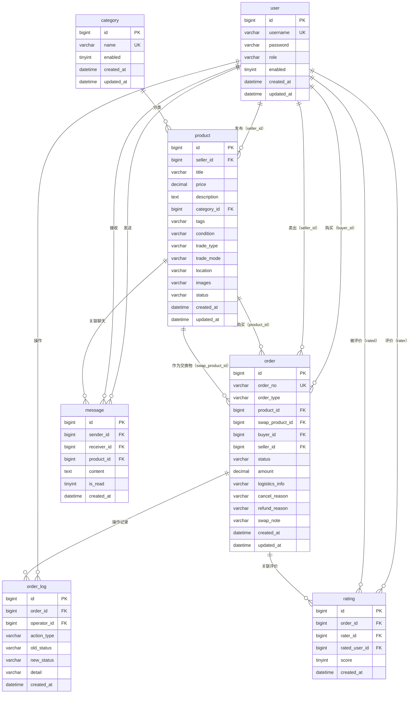

# 二手交易平台 数据模型设计

| 项目 | 内容 |
| --- | --- |
| 文档版本 | v1.1（新增举报表） |
| 适用版本 | 最小可行产品（MVP） |
| 编制依据 | 《产品需求文档（PRD）v1.3》、《软件需求规格说明书（SRS）v1.3》 |
| 当前状态 | 待确认 |
| 编制日期 | 2026-07-08 |

## 1. 文档目的与范围

本文档定义二手交易平台 MVP 的 MySQL 数据库设计，包括实体关系图（ER 图）、表结构定义、字段类型与约束、索引策略、JPA 映射参考和初始化数据脚本。本文档是接口设计和技术实现的数据层依据。

**技术环境：**
- 数据库：MySQL 8.0+
- ORM：Spring Data JPA（Hibernate）
- DDL 策略：`spring.jpa.hibernate.ddl-auto=update`（开发阶段自动建表）
- 字符集：`utf8mb4`，排序规则：`utf8mb4_unicode_ci`

## 2. 实体关系图（ER 图）



### 实体关系说明

| 关系 | 说明 | 基数 |
| --- | --- | --- |
| user → product | 一个用户可发布多件商品 | 1:N |
| user → order（买家） | 一个用户可创建多笔订单 | 1:N |
| user → order（卖家） | 一个用户可收到多笔订单 | 1:N |
| category → product | 一个分类下有多件商品 | 1:N |
| product → order | 一件商品可被购买生成多笔订单（取消后重新上架） | 1:N |
| order → order_log | 一笔订单有多条操作日志 | 1:N |
| order → rating | 一笔订单有 0-2 条评价（双方各一条） | 1:N |
| user → message | 一个用户可发送/接收多条消息 | 1:N |
| product → message | 一件商品关联多条聊天消息 | 1:N |

## 3. 实体详细设计

### 3.1 用户表（`user`）

存储所有系统用户（普通用户和管理员）的账号信息。

| 字段 | 类型 | 约束 | 说明 |
| --- | --- | --- | --- |
| `id` | `BIGINT` | PK, AUTO_INCREMENT | 用户唯一标识。 |
| `username` | `VARCHAR(50)` | NOT NULL, UNIQUE | 用户名，登录标识。去除首尾空白后唯一存储。 |
| `password` | `VARCHAR(255)` | NOT NULL | BCrypt 哈希后的密码，不可明文。 |
| `role` | `VARCHAR(20)` | NOT NULL, DEFAULT 'USER' | 角色：`USER`（普通用户）、`ADMIN`（管理员）。 |
| `enabled` | `TINYINT(1)` | NOT NULL, DEFAULT 1 | 账号状态：1=启用，0=禁用。 |
| `created_at` | `DATETIME` | NOT NULL, DEFAULT CURRENT_TIMESTAMP | 注册时间。 |
| `updated_at` | `DATETIME` | NOT NULL, DEFAULT CURRENT_TIMESTAMP ON UPDATE | 最后更新时间。 |

**索引：**

| 索引名 | 列 | 类型 | 说明 |
| --- | --- | --- | --- |
| `pk_user` | `id` | PRIMARY | 主键。 |
| `uk_username` | `username` | UNIQUE | 用户名唯一约束。 |
| `idx_user_role_enabled` | `role, enabled` | NORMAL | 管理员查询用户列表。 |

**JPA 参考：**

```java
@Entity
@Table(name = "user")
public class User {
    @Id
    @GeneratedValue(strategy = GenerationType.IDENTITY)
    private Long id;

    @Column(nullable = false, unique = true, length = 50)
    private String username;

    @Column(nullable = false)
    private String password;  // BCrypt 哈希

    @Column(nullable = false, length = 20)
    @Enumerated(EnumType.STRING)
    private UserRole role = UserRole.USER;

    @Column(nullable = false)
    private Boolean enabled = true;

    @Column(name = "created_at", nullable = false, updatable = false)
    private LocalDateTime createdAt;

    @Column(name = "updated_at", nullable = false)
    private LocalDateTime updatedAt;

    // @PrePersist / @PreUpdate 自动设置时间戳
}
```

### 3.2 分类表（`category`）

商品发布时可选择的一级分类，由管理员维护。

| 字段 | 类型 | 约束 | 说明 |
| --- | --- | --- | --- |
| `id` | `BIGINT` | PK, AUTO_INCREMENT | 分类唯一标识。 |
| `name` | `VARCHAR(50)` | NOT NULL, UNIQUE | 分类名称（如数码、服饰）。去除首尾空白后唯一。 |
| `enabled` | `TINYINT(1)` | NOT NULL, DEFAULT 1 | 状态：1=启用，0=停用。 |
| `created_at` | `DATETIME` | NOT NULL, DEFAULT CURRENT_TIMESTAMP | 创建时间。 |
| `updated_at` | `DATETIME` | NOT NULL, DEFAULT CURRENT_TIMESTAMP ON UPDATE | 最后更新时间。 |

**索引：**

| 索引名 | 列 | 类型 | 说明 |
| --- | --- | --- | --- |
| `pk_category` | `id` | PRIMARY | 主键。 |
| `uk_category_name` | `name` | UNIQUE | 分类名称唯一。 |
| `idx_category_enabled` | `enabled` | NORMAL | 发布商品时查询有效分类。 |

**初始化数据：**

```sql
INSERT INTO category (name, enabled) VALUES
('数码', 1), ('服饰', 1), ('家居', 1), ('图书', 1), ('其他', 1);
```

### 3.3 商品表（`product`）

卖家发布的闲置物品信息。

| 字段 | 类型 | 约束 | 说明 |
| --- | --- | --- | --- |
| `id` | `BIGINT` | PK, AUTO_INCREMENT | 商品唯一标识。 |
| `seller_id` | `BIGINT` | NOT NULL, FK → `user.id` | 卖家用户 ID。 |
| `title` | `VARCHAR(100)` | NOT NULL | 商品标题，去除首尾空白。 |
| `price` | `DECIMAL(10,2)` | NOT NULL | 商品价格（元），正数，最大 999999.99。 |
| `description` | `TEXT` | NOT NULL | 商品描述，1-4000 字符。 |
| `category_id` | `BIGINT` | NOT NULL, FK → `category.id` | 所属分类。 |
| `tags` | `VARCHAR(255)` | NULL | 自定义标签，逗号分隔，最多 5 个。 |
| `condition` | `VARCHAR(20)` | NOT NULL | 成色枚举：`NEW`（全新）、`LIKE_NEW`（几乎全新）、`USED`（有使用痕迹）。 |
| `trade_type` | `VARCHAR(20)` | NOT NULL | 交易方式枚举：`PICKUP`（自提）、`EXPRESS`（快递）、`BOTH`（两者均可）。 |
| `trade_mode` | `VARCHAR(10)` | NOT NULL, DEFAULT 'SELL' | 交易模式枚举：`SELL`（仅出售）、`SWAP`（仅交换）、`BOTH`（两者均可）。 |
| `location` | `VARCHAR(50)` | NOT NULL | 所在地，1-50 字符。 |
| `images` | `VARCHAR(1024)` | NULL | 图片路径列表，逗号分隔，如 `uploads/1/img1.jpg,uploads/1/img2.jpg`。最多 3 张。 |
| `status` | `VARCHAR(20)` | NOT NULL, DEFAULT 'ACTIVE' | 商品状态枚举：`ACTIVE`（在售）、`SOLD`（已售）、`OFF`（已下架）。 |
| `created_at` | `DATETIME` | NOT NULL, DEFAULT CURRENT_TIMESTAMP | 发布时间。 |
| `updated_at` | `DATETIME` | NOT NULL, DEFAULT CURRENT_TIMESTAMP ON UPDATE | 最后更新时间。 |

**索引：**

| 索引名 | 列 | 类型 | 说明 |
| --- | --- | --- | --- |
| `pk_product` | `id` | PRIMARY | 主键。 |
| `idx_product_seller` | `seller_id` | NORMAL | 卖家商品管理查询。 |
| `idx_product_category` | `category_id` | NORMAL | 分类浏览查询。 |
| `idx_product_status_time` | `status, created_at` | COMPOSITE | 首页最新在售商品查询（`WHERE status='ACTIVE' ORDER BY created_at DESC`）。 |
| `idx_product_seller_status` | `seller_id, status` | COMPOSITE | 卖家按状态筛选商品。 |

**JPA 参考：**

```java
@Entity
@Table(name = "product", indexes = {
    @Index(name = "idx_product_status_time", columnList = "status, created_at"),
    @Index(name = "idx_product_seller_status", columnList = "seller_id, status")
})
public class Product {
    @Id @GeneratedValue(strategy = GenerationType.IDENTITY)
    private Long id;

    @ManyToOne(fetch = FetchType.LAZY)
    @JoinColumn(name = "seller_id", nullable = false)
    private User seller;

    @Column(nullable = false, length = 100)
    private String title;

    @Column(nullable = false, precision = 10, scale = 2)
    private BigDecimal price;

    @Column(nullable = false, columnDefinition = "TEXT")
    private String description;

    @ManyToOne(fetch = FetchType.LAZY)
    @JoinColumn(name = "category_id", nullable = false)
    private Category category;

    @Column(length = 255)
    private String tags;

    @Column(nullable = false, length = 20)
    @Enumerated(EnumType.STRING)
    private ProductCondition condition;

    @Column(name = "trade_type", nullable = false, length = 20)
    @Enumerated(EnumType.STRING)
    private TradeType tradeType;

    @Column(name = "trade_mode", nullable = false, length = 10)
    @Enumerated(EnumType.STRING)
    private TradeMode tradeMode = TradeMode.SELL;

    @Column(nullable = false, length = 50)
    private String location;

    @Column(length = 1024)
    private String images;

    @Column(nullable = false, length = 20)
    @Enumerated(EnumType.STRING)
    private ProductStatus status = ProductStatus.ACTIVE;

    @Column(name = "created_at", nullable = false, updatable = false)
    private LocalDateTime createdAt;

    @Column(name = "updated_at", nullable = false)
    private LocalDateTime updatedAt;
}
```

### 3.4 订单表（`order`）

现金交易订单和以物易物交换订单统一存储，通过 `order_type` 区分。

| 字段 | 类型 | 约束 | 说明 |
| --- | --- | --- | --- |
| `id` | `BIGINT` | PK, AUTO_INCREMENT | 订单唯一标识（内部）。 |
| `order_no` | `VARCHAR(30)` | NOT NULL, UNIQUE | 业务订单编号，格式 `ORD-20260708-XXXXX`（现金）或 `SWP-20260708-XXXXX`（交换）。 |
| `order_type` | `VARCHAR(10)` | NOT NULL | 订单类型枚举：`CASH`（现金交易）、`SWAP`（以物易物）。 |
| `product_id` | `BIGINT` | NOT NULL, FK → `product.id` | 目标商品（卖家发布的商品）。 |
| `swap_product_id` | `BIGINT` | NULL, FK → `product.id` | 交换商品（买家提供的交换物），仅 `order_type=SWAP` 时有值。 |
| `buyer_id` | `BIGINT` | NOT NULL, FK → `user.id` | 买家/交换发起方。 |
| `seller_id` | `BIGINT` | NOT NULL, FK → `user.id` | 卖家/交换接收方。 |
| `status` | `VARCHAR(20)` | NOT NULL | 订单状态（见 §3.4.1 状态值表）。 |
| `amount` | `DECIMAL(10,2)` | NOT NULL | 订单金额。现金订单为商品价格；交换订单为 0.00（MVP 无补差价）。 |
| `logistics_info` | `VARCHAR(500)` | NULL | 物流信息（快递单号或自提说明）。 |
| `cancel_reason` | `VARCHAR(500)` | NULL | 取消原因。 |
| `refund_reason` | `VARCHAR(500)` | NULL | 退款原因。 |
| `swap_note` | `VARCHAR(500)` | NULL | 交换意向说明，仅交换订单有值。 |
| `created_at` | `DATETIME` | NOT NULL, DEFAULT CURRENT_TIMESTAMP | 创建时间。 |
| `updated_at` | `DATETIME` | NOT NULL, DEFAULT CURRENT_TIMESTAMP ON UPDATE | 最后更新时间。 |

#### 3.4.1 订单状态枚举

**现金订单（`order_type=CASH`）：**

| 状态值 | 中文名称 | 说明 |
| --- | --- | --- |
| `PENDING_PAY` | 待付款 | 买家已下单，等待付款。 |
| `PAID` | 已付款 | 买家已付款（模拟），等待卖家发货。 |
| `SHIPPED` | 已发货 | 卖家已发货，等待买家收货。 |
| `RECEIVED` | 已收货 | 买家已收货，等待完成或退款。 |
| `DISPUTE` | 退款中 | 退款被卖家拒绝，等待管理员裁定。 |
| `COMPLETED` | 已完成 | 交易完成，可评价。 |
| `CANCELLED` | 已取消 | 订单已取消。 |

**交换订单（`order_type=SWAP`）：**

| 状态值 | 中文名称 | 说明 |
| --- | --- | --- |
| `PENDING_CONFIRM` | 待确认 | 买家发起提议，等待卖家确认。 |
| `CONFIRMED` | 已确认 | 卖家同意交换，等待双方发货。 |
| `BOTH_SHIPPED` | 双方已发货 | 双方均发货，等待双方收货。 |
| `COMPLETED` | 已完成 | 双方均收货，交换完成。 |
| `REJECTED` | 已拒绝 | 卖家拒绝提议，终态。 |
| `CANCELLED` | 已取消 | 买家撤回或双方协商取消，终态。 |

**索引：**

| 索引名 | 列 | 类型 | 说明 |
| --- | --- | --- | --- |
| `pk_order` | `id` | PRIMARY | 主键。 |
| `uk_order_no` | `order_no` | UNIQUE | 业务编号唯一。 |
| `idx_order_buyer_status` | `buyer_id, status` | COMPOSITE | 买家订单列表查询。 |
| `idx_order_seller_status` | `seller_id, status` | COMPOSITE | 卖家订单列表查询。 |
| `idx_order_product` | `product_id` | NORMAL | 商品关联订单查询。 |
| `idx_order_type_status` | `order_type, status` | COMPOSITE | 管理员按类型和状态查询。 |
| `idx_order_created` | `created_at` | NORMAL | 按时间排序。 |

### 3.5 订单操作日志表（`order_log`）

记录订单每一次状态变更，用于交易追溯和纠纷裁定。

| 字段 | 类型 | 约束 | 说明 |
| --- | --- | --- | --- |
| `id` | `BIGINT` | PK, AUTO_INCREMENT | 日志唯一标识。 |
| `order_id` | `BIGINT` | NOT NULL, FK → `order.id` | 关联订单。 |
| `operator_id` | `BIGINT` | NOT NULL, FK → `user.id` | 操作人（系统自动操作时可为 0 或 SYSTEM 账号）。 |
| `action_type` | `VARCHAR(30)` | NOT NULL | 操作类型枚举（见 §3.5.1）。 |
| `old_status` | `VARCHAR(20)` | NULL | 操作前的订单状态（创建时为 NULL）。 |
| `new_status` | `VARCHAR(20)` | NOT NULL | 操作后的订单状态。 |
| `detail` | `VARCHAR(1000)` | NULL | 操作详情（取消原因、退款原因、物流信息、裁定理由等）。 |
| `created_at` | `DATETIME` | NOT NULL, DEFAULT CURRENT_TIMESTAMP | 操作时间，精确到秒。 |

#### 3.5.1 操作类型枚举

| 值 | 说明 | 触发场景 |
| --- | --- | --- |
| `CREATE` | 创建订单 | 买家下单/发起交换提议。 |
| `PAY` | 付款 | 买家模拟付款（仅现金订单）。 |
| `SHIP` | 发货 | 卖家/交换方发货。 |
| `RECEIVE` | 收货 | 买家/交换方确认收货。 |
| `AUTO_COMPLETE` | 自动完成 | 系统在收货 3 天后自动完成。 |
| `CANCEL` | 取消 | 买家取消/撤回或卖家主动取消。 |
| `REQUEST_REFUND` | 申请退款 | 买家申请退款。 |
| `AGREE_REFUND` | 同意退款 | 卖家同意退款。 |
| `REJECT_REFUND` | 拒绝退款 | 卖家拒绝退款。 |
| `ADMIN_JUDGE` | 管理员裁定 | 管理员处理纠纷。 |
| `AGREE_SWAP` | 同意交换 | 卖家同意交换提议。 |
| `REJECT_SWAP` | 拒绝交换 | 卖家拒绝交换提议。 |
| `REQUEST_CANCEL_SWAP` | 申请取消交换 | 已确认后一方申请取消。 |

**索引：**

| 索引名 | 列 | 类型 | 说明 |
| --- | --- | --- | --- |
| `pk_order_log` | `id` | PRIMARY | 主键。 |
| `idx_log_order_time` | `order_id, created_at` | COMPOSITE | 订单操作时间线查询。 |

### 3.6 聊天消息表（`message`）

存储买卖双方 WebSocket 实时聊天消息。

| 字段 | 类型 | 约束 | 说明 |
| --- | --- | --- | --- |
| `id` | `BIGINT` | PK, AUTO_INCREMENT | 消息唯一标识。 |
| `sender_id` | `BIGINT` | NOT NULL, FK → `user.id` | 发送方。 |
| `receiver_id` | `BIGINT` | NOT NULL, FK → `user.id` | 接收方。 |
| `product_id` | `BIGINT` | NULL, FK → `product.id` | 关联商品（从商品详情发起聊天时关联）。 |
| `content` | `TEXT` | NOT NULL | 消息内容，1-2000 字符。 |
| `is_read` | `TINYINT(1)` | NOT NULL, DEFAULT 0 | 已读状态：1=已读，0=未读。 |
| `created_at` | `DATETIME` | NOT NULL, DEFAULT CURRENT_TIMESTAMP | 发送时间。 |

**索引：**

| 索引名 | 列 | 类型 | 说明 |
| --- | --- | --- | --- |
| `pk_message` | `id` | PRIMARY | 主键。 |
| `idx_msg_conversation` | `sender_id, receiver_id, product_id` | COMPOSITE | 查询两个用户关于某商品的对话。 |
| `idx_msg_contact_list` | `receiver_id, is_read, created_at` | COMPOSITE | 联系人列表 + 未读计数。 |

**联系人列表查询逻辑：**

```sql
-- 获取当前用户的所有联系人及其最后一条消息
SELECT DISTINCT
    CASE WHEN sender_id = ? THEN receiver_id ELSE sender_id END AS contact_id,
    -- 子查询获取最后消息和时间
FROM message
WHERE sender_id = ? OR receiver_id = ?
ORDER BY MAX(created_at) DESC;
```

### 3.7 评价表（`rating`）

交易/交换完成后的买卖双方互评记录。

| 字段 | 类型 | 约束 | 说明 |
| --- | --- | --- | --- |
| `id` | `BIGINT` | PK, AUTO_INCREMENT | 评价唯一标识。 |
| `order_id` | `BIGINT` | NOT NULL, FK → `order.id` | 关联订单。 |
| `rater_id` | `BIGINT` | NOT NULL, FK → `user.id` | 评价人。 |
| `rated_user_id` | `BIGINT` | NOT NULL, FK → `user.id` | 被评价人。 |
| `score` | `TINYINT` | NOT NULL | 评分，1-5 星整数。 |
| `created_at` | `DATETIME` | NOT NULL, DEFAULT CURRENT_TIMESTAMP | 评价时间，创建后不可修改。 |

**约束：**
- 同一用户对同一订单只能评价一次（`UNIQUE(order_id, rater_id)`）。
- 评价人和被评价人必须是同一订单的买卖双方。
- `score` 值域 1-5。

**索引：**

| 索引名 | 列 | 类型 | 说明 |
| --- | --- | --- | --- |
| `pk_rating` | `id` | PRIMARY | 主键。 |
| `uk_rating_order_rater` | `order_id, rater_id` | UNIQUE | 每人对每订单只能评价一次。 |
| `idx_rating_rated_user` | `rated_user_id` | NORMAL | 用户主页评价查询。 |

**用户评分计算：**

```sql
-- 查询某用户的平均评分和评价数量
SELECT
    COUNT(*) AS rating_count,
    AVG(score) AS avg_score
FROM rating
WHERE rated_user_id = ?;
```

### 3.8 举报表（`report`）

用户对违规商品、用户或聊天消息的举报记录。

| 字段 | 类型 | 约束 | 说明 |
| --- | --- | --- | --- |
| `id` | `BIGINT` | PK, AUTO_INCREMENT | 举报唯一标识。 |
| `reporter_id` | `BIGINT` | NOT NULL, FK → `user.id` | 举报人。 |
| `target_type` | `VARCHAR(10)` | NOT NULL | 举报对象类型枚举：`PRODUCT`（商品）、`USER`（用户）、`MESSAGE`（消息）。 |
| `target_id` | `BIGINT` | NOT NULL | 举报对象 ID（商品 ID / 用户 ID / 消息 ID）。 |
| `reason` | `VARCHAR(50)` | NOT NULL | 举报原因预设选项：`FAKE_DESC`（虚假描述）、`PROHIBITED`（违禁品）、`FRAUD`（欺诈行为）、`HARASS`（骚扰/辱骂）、`OTHER`（其他）。 |
| `description` | `VARCHAR(500)` | NULL | 补充描述。 |
| `status` | `VARCHAR(20)` | NOT NULL, DEFAULT 'PENDING' | 状态枚举：`PENDING`（待处理）、`PROCESSING`（处理中）、`ACCEPTED`（已受理）、`REJECTED`（已驳回）、`APPEALING`（申诉中）。 |
| `admin_note` | `VARCHAR(500)` | NULL | 管理员处理备注。 |
| `appeal_reason` | `VARCHAR(500)` | NULL | 被举报人申诉理由。 |
| `appeal_result` | `VARCHAR(20)` | NULL | 申诉结果：`UPHELD`（维持原判）、`OVERTURNED`（改判）。 |
| `created_at` | `DATETIME` | NOT NULL, DEFAULT CURRENT_TIMESTAMP | 举报时间。 |
| `updated_at` | `DATETIME` | NOT NULL, DEFAULT CURRENT_TIMESTAMP ON UPDATE | 最后更新时间。 |

**约束：**
- 同一用户对同一对象不可重复提交未处理的举报（`UNIQUE(reporter_id, target_type, target_id)` + WHERE status IN ('PENDING', 'PROCESSING') 业务校验）。

**索引：**

| 索引名 | 列 | 类型 | 说明 |
| --- | --- | --- | --- |
| `pk_report` | `id` | PRIMARY | 主键。 |
| `idx_report_status` | `status, created_at` | COMPOSITE | 管理员按状态筛选举报。 |
| `idx_report_reporter` | `reporter_id` | NORMAL | 用户查看自己的举报记录。 |
| `idx_report_target` | `target_type, target_id` | NORMAL | 按对象查询举报。 |

---

## 4. 索引设计汇总

| 表 | 索引名 | 列 | 类型 | 用途 |
| --- | --- | --- | --- | --- |
| user | `pk_user` | `id` | PRIMARY | 主键查找。 |
| user | `uk_username` | `username` | UNIQUE | 登录查找、注册去重。 |
| user | `idx_user_role_enabled` | `role, enabled` | NORMAL | 管理员查用户列表。 |
| category | `pk_category` | `id` | PRIMARY | 主键查找。 |
| category | `uk_category_name` | `name` | UNIQUE | 分类名去重。 |
| category | `idx_category_enabled` | `enabled` | NORMAL | 有效分类查询。 |
| product | `pk_product` | `id` | PRIMARY | 主键查找。 |
| product | `idx_product_seller` | `seller_id` | NORMAL | 卖家商品管理。 |
| product | `idx_product_category` | `category_id` | NORMAL | 分类浏览。 |
| product | `idx_product_status_time` | `status, created_at` | COMPOSITE | 首页最新在售。 |
| product | `idx_product_seller_status` | `seller_id, status` | COMPOSITE | 卖家按状态筛选。 |
| order | `pk_order` | `id` | PRIMARY | 主键查找。 |
| order | `uk_order_no` | `order_no` | UNIQUE | 业务编号查找。 |
| order | `idx_order_buyer_status` | `buyer_id, status` | COMPOSITE | 买家订单列表。 |
| order | `idx_order_seller_status` | `seller_id, status` | COMPOSITE | 卖家订单列表。 |
| order | `idx_order_product` | `product_id` | NORMAL | 商品关联订单。 |
| order | `idx_order_type_status` | `order_type, status` | COMPOSITE | 管理员订单管理。 |
| order | `idx_order_created` | `created_at` | NORMAL | 时间排序。 |
| order_log | `pk_order_log` | `id` | PRIMARY | 主键查找。 |
| order_log | `idx_log_order_time` | `order_id, created_at` | COMPOSITE | 订单时间线。 |
| message | `pk_message` | `id` | PRIMARY | 主键查找。 |
| message | `idx_msg_conversation` | `sender_id, receiver_id, product_id` | COMPOSITE | 对话查询。 |
| message | `idx_msg_contact_list` | `receiver_id, is_read, created_at` | COMPOSITE | 联系人列表。 |
| rating | `pk_rating` | `id` | PRIMARY | 主键查找。 |
| rating | `uk_rating_order_rater` | `order_id, rater_id` | UNIQUE | 一人一评约束。 |
| rating | `idx_rating_rated_user` | `rated_user_id` | NORMAL | 用户评分查询。 |

**索引策略说明：**
- MVP 阶段数据量小（≤200 用户、≤500 商品），以上索引已足够覆盖所有查询场景。
- 商品标题和描述的搜索使用 `LIKE '%keyword%'`，不建全文索引。若后续数据量增长需要，可引入 MySQL FULLTEXT 索引或 Elasticsearch。
- 所有外键列均建立索引，确保 JOIN 查询效率。

## 5. 状态枚举定义

### 5.1 商品状态（ProductStatus）

| 枚举值 | 中文 | 含义 |
| --- | --- | --- |
| `ACTIVE` | 在售 | 正常展示，可浏览和购买。 |
| `SOLD` | 已售 | 已被购买，不再公开展示。订单取消后自动恢复为 ACTIVE。 |
| `OFF` | 已下架 | 卖家主动下架。 |

### 5.2 交易模式（TradeMode）

| 枚举值 | 中文 | 含义 |
| --- | --- | --- |
| `SELL` | 仅出售 | 商品仅支持现金购买。 |
| `SWAP` | 仅交换 | 商品仅支持以物易物。 |
| `BOTH` | 两者均可 | 商品同时支持购买和交换。 |

### 5.3 成色（ProductCondition）

| 枚举值 | 中文 |
| --- | --- |
| `NEW` | 全新 |
| `LIKE_NEW` | 几乎全新 |
| `USED` | 有使用痕迹 |

### 5.4 交易方式（TradeType）

| 枚举值 | 中文 |
| --- | --- |
| `PICKUP` | 自提 |
| `EXPRESS` | 快递 |
| `BOTH` | 两者均可 |

### 5.5 用户角色（UserRole）

| 枚举值 | 中文 |
| --- | --- |
| `USER` | 普通用户 |
| `ADMIN` | 管理员 |

## 6. JPA 实体关系映射

```
User (1) ──→ (N) Product   : @OneToMany(mappedBy = "seller")
User (1) ──→ (N) Order     : @OneToMany(mappedBy = "buyer") + @OneToMany(mappedBy = "seller")
User (1) ──→ (N) Message   : @OneToMany(mappedBy = "sender") + @OneToMany(mappedBy = "receiver")
User (1) ──→ (N) Rating    : @OneToMany(mappedBy = "rater") + @OneToMany(mappedBy = "ratedUser")

Category (1) ──→ (N) Product : @OneToMany(mappedBy = "category")

Product (1) ──→ (N) Order  : @OneToMany(mappedBy = "product")
Product (1) ──→ (N) Message: @OneToMany(mappedBy = "product")

Order (1) ──→ (N) OrderLog : @OneToMany(mappedBy = "order", cascade = ALL)
Order (1) ──→ (N) Rating   : @OneToMany(mappedBy = "order")
```

**关联加载策略：**
- 所有 `@ManyToOne` 使用 `FetchType.LAZY`，避免 N+1 查询。
- 需要关联数据时在 Repository 中使用 `@EntityGraph` 或 `JOIN FETCH`。

## 7. DDL 参考

```sql
-- 字符集设置
CREATE DATABASE IF NOT EXISTS flea_market
    DEFAULT CHARACTER SET utf8mb4
    DEFAULT COLLATE utf8mb4_unicode_ci;

USE flea_market;

-- 用户表
CREATE TABLE user (
    id BIGINT AUTO_INCREMENT PRIMARY KEY,
    username VARCHAR(50) NOT NULL,
    password VARCHAR(255) NOT NULL,
    role VARCHAR(20) NOT NULL DEFAULT 'USER',
    enabled TINYINT(1) NOT NULL DEFAULT 1,
    created_at DATETIME NOT NULL DEFAULT CURRENT_TIMESTAMP,
    updated_at DATETIME NOT NULL DEFAULT CURRENT_TIMESTAMP ON UPDATE CURRENT_TIMESTAMP,
    UNIQUE KEY uk_username (username),
    KEY idx_user_role_enabled (role, enabled)
) ENGINE=InnoDB DEFAULT CHARSET=utf8mb4 COLLATE=utf8mb4_unicode_ci;

-- 分类表
CREATE TABLE category (
    id BIGINT AUTO_INCREMENT PRIMARY KEY,
    name VARCHAR(50) NOT NULL,
    enabled TINYINT(1) NOT NULL DEFAULT 1,
    created_at DATETIME NOT NULL DEFAULT CURRENT_TIMESTAMP,
    updated_at DATETIME NOT NULL DEFAULT CURRENT_TIMESTAMP ON UPDATE CURRENT_TIMESTAMP,
    UNIQUE KEY uk_category_name (name),
    KEY idx_category_enabled (enabled)
) ENGINE=InnoDB DEFAULT CHARSET=utf8mb4 COLLATE=utf8mb4_unicode_ci;

-- 商品表
CREATE TABLE product (
    id BIGINT AUTO_INCREMENT PRIMARY KEY,
    seller_id BIGINT NOT NULL,
    title VARCHAR(100) NOT NULL,
    price DECIMAL(10, 2) NOT NULL,
    description TEXT NOT NULL,
    category_id BIGINT NOT NULL,
    tags VARCHAR(255),
    `condition` VARCHAR(20) NOT NULL,
    trade_type VARCHAR(20) NOT NULL,
    trade_mode VARCHAR(10) NOT NULL DEFAULT 'SELL',
    location VARCHAR(50) NOT NULL,
    images VARCHAR(1024),
    status VARCHAR(20) NOT NULL DEFAULT 'ACTIVE',
    created_at DATETIME NOT NULL DEFAULT CURRENT_TIMESTAMP,
    updated_at DATETIME NOT NULL DEFAULT CURRENT_TIMESTAMP ON UPDATE CURRENT_TIMESTAMP,
    KEY idx_product_seller (seller_id),
    KEY idx_product_category (category_id),
    KEY idx_product_status_time (status, created_at),
    KEY idx_product_seller_status (seller_id, status),
    CONSTRAINT fk_product_seller FOREIGN KEY (seller_id) REFERENCES user (id),
    CONSTRAINT fk_product_category FOREIGN KEY (category_id) REFERENCES category (id)
) ENGINE=InnoDB DEFAULT CHARSET=utf8mb4 COLLATE=utf8mb4_unicode_ci;

-- 订单表
CREATE TABLE `order` (
    id BIGINT AUTO_INCREMENT PRIMARY KEY,
    order_no VARCHAR(30) NOT NULL,
    order_type VARCHAR(10) NOT NULL,
    product_id BIGINT NOT NULL,
    swap_product_id BIGINT,
    buyer_id BIGINT NOT NULL,
    seller_id BIGINT NOT NULL,
    status VARCHAR(20) NOT NULL,
    amount DECIMAL(10, 2) NOT NULL DEFAULT 0.00,
    logistics_info VARCHAR(500),
    cancel_reason VARCHAR(500),
    refund_reason VARCHAR(500),
    swap_note VARCHAR(500),
    created_at DATETIME NOT NULL DEFAULT CURRENT_TIMESTAMP,
    updated_at DATETIME NOT NULL DEFAULT CURRENT_TIMESTAMP ON UPDATE CURRENT_TIMESTAMP,
    UNIQUE KEY uk_order_no (order_no),
    KEY idx_order_buyer_status (buyer_id, status),
    KEY idx_order_seller_status (seller_id, status),
    KEY idx_order_product (product_id),
    KEY idx_order_type_status (order_type, status),
    KEY idx_order_created (created_at),
    CONSTRAINT fk_order_product FOREIGN KEY (product_id) REFERENCES product (id),
    CONSTRAINT fk_order_swap_product FOREIGN KEY (swap_product_id) REFERENCES product (id),
    CONSTRAINT fk_order_buyer FOREIGN KEY (buyer_id) REFERENCES user (id),
    CONSTRAINT fk_order_seller FOREIGN KEY (seller_id) REFERENCES user (id)
) ENGINE=InnoDB DEFAULT CHARSET=utf8mb4 COLLATE=utf8mb4_unicode_ci;

-- 订单操作日志表
CREATE TABLE order_log (
    id BIGINT AUTO_INCREMENT PRIMARY KEY,
    order_id BIGINT NOT NULL,
    operator_id BIGINT NOT NULL,
    action_type VARCHAR(30) NOT NULL,
    old_status VARCHAR(20),
    new_status VARCHAR(20) NOT NULL,
    detail VARCHAR(1000),
    created_at DATETIME NOT NULL DEFAULT CURRENT_TIMESTAMP,
    KEY idx_log_order_time (order_id, created_at),
    CONSTRAINT fk_log_order FOREIGN KEY (order_id) REFERENCES `order` (id),
    CONSTRAINT fk_log_operator FOREIGN KEY (operator_id) REFERENCES user (id)
) ENGINE=InnoDB DEFAULT CHARSET=utf8mb4 COLLATE=utf8mb4_unicode_ci;

-- 聊天消息表
CREATE TABLE message (
    id BIGINT AUTO_INCREMENT PRIMARY KEY,
    sender_id BIGINT NOT NULL,
    receiver_id BIGINT NOT NULL,
    product_id BIGINT,
    content TEXT NOT NULL,
    is_read TINYINT(1) NOT NULL DEFAULT 0,
    created_at DATETIME NOT NULL DEFAULT CURRENT_TIMESTAMP,
    KEY idx_msg_conversation (sender_id, receiver_id, product_id),
    KEY idx_msg_contact_list (receiver_id, is_read, created_at),
    CONSTRAINT fk_msg_sender FOREIGN KEY (sender_id) REFERENCES user (id),
    CONSTRAINT fk_msg_receiver FOREIGN KEY (receiver_id) REFERENCES user (id),
    CONSTRAINT fk_msg_product FOREIGN KEY (product_id) REFERENCES product (id)
) ENGINE=InnoDB DEFAULT CHARSET=utf8mb4 COLLATE=utf8mb4_unicode_ci;

-- 评价表
CREATE TABLE rating (
    id BIGINT AUTO_INCREMENT PRIMARY KEY,
    order_id BIGINT NOT NULL,
    rater_id BIGINT NOT NULL,
    rated_user_id BIGINT NOT NULL,
    score TINYINT NOT NULL,
    created_at DATETIME NOT NULL DEFAULT CURRENT_TIMESTAMP,
    UNIQUE KEY uk_rating_order_rater (order_id, rater_id),
    KEY idx_rating_rated_user (rated_user_id),
    CONSTRAINT fk_rating_order FOREIGN KEY (order_id) REFERENCES `order` (id),
    CONSTRAINT fk_rating_rater FOREIGN KEY (rater_id) REFERENCES user (id),
    CONSTRAINT fk_rating_rated_user FOREIGN KEY (rated_user_id) REFERENCES user (id),
    CONSTRAINT chk_rating_score CHECK (score >= 1 AND score <= 5)
) ENGINE=InnoDB DEFAULT CHARSET=utf8mb4 COLLATE=utf8mb4_unicode_ci;

-- 举报表
CREATE TABLE report (
    id BIGINT AUTO_INCREMENT PRIMARY KEY,
    reporter_id BIGINT NOT NULL,
    target_type VARCHAR(10) NOT NULL,
    target_id BIGINT NOT NULL,
    reason VARCHAR(50) NOT NULL,
    description VARCHAR(500),
    status VARCHAR(20) NOT NULL DEFAULT 'PENDING',
    admin_note VARCHAR(500),
    appeal_reason VARCHAR(500),
    appeal_result VARCHAR(20),
    created_at DATETIME NOT NULL DEFAULT CURRENT_TIMESTAMP,
    updated_at DATETIME NOT NULL DEFAULT CURRENT_TIMESTAMP ON UPDATE CURRENT_TIMESTAMP,
    KEY idx_report_status (status, created_at),
    KEY idx_report_reporter (reporter_id),
    KEY idx_report_target (target_type, target_id),
    CONSTRAINT fk_report_reporter FOREIGN KEY (reporter_id) REFERENCES user (id)
) ENGINE=InnoDB DEFAULT CHARSET=utf8mb4 COLLATE=utf8mb4_unicode_ci;
```

## 8. 数据初始化脚本

系统首次启动时应执行以下初始化逻辑（由 `DataInitializer` 组件在 `ApplicationRunner` 中执行）：

```java
@Component
public class DataInitializer implements ApplicationRunner {

    @Override
    public void run(ApplicationArguments args) {
        initCategories();
        // 管理员通过 /api/init 接口手动初始化
    }

    private void initCategories() {
        if (categoryRepository.count() == 0) {
            String[] defaultCategories = {"数码", "服饰", "家居", "图书", "其他"};
            for (String name : defaultCategories) {
                Category category = new Category();
                category.setName(name);
                category.setEnabled(true);
                categoryRepository.save(category);
            }
        }
    }
}
```

**初始化顺序：**
1. Spring Boot 启动 → Hibernate 自动执行 DDL（`ddl-auto=update`）
2. `DataInitializer` 检测并插入默认分类
3. 管理员通过 `POST /api/init` 接口创建首个管理员账号
4. 平台就绪，开放用户注册

## 9. 命名规范总结

| 类别 | 规范 | 示例 |
| --- | --- | --- |
| 表名 | 小写，单词间用下划线 | `user`, `order_log` |
| 列名 | 小写，单词间用下划线 | `seller_id`, `created_at` |
| 主键 | `id` | `id BIGINT AUTO_INCREMENT` |
| 外键 | `{关联表}_id` | `seller_id`, `product_id` |
| 索引 | `{idx/uk}_{表}_{列}` | `idx_product_status_time`, `uk_username` |
| 枚举值 | 大写，单词间用下划线 | `PENDING_PAY`, `LIKE_NEW` |
| 时间列 | `created_at`, `updated_at` | — |
| 布尔列 | `is_{状态}` | `is_read` |

## 10. 与 SRS 的对应关系

| SRS 需求 | 数据模型对应 |
| --- | --- |
| SRS-DAT-001 至 009（持久化需求） | 本文档全部表结构设计。 |
| SRS-AUTH-001 至 016（认证需求） | `user` 表 + BCrypt 密码哈希。 |
| SRS-CAT-001 至 006（分类需求） | `category` 表。 |
| SRS-PRD-001 至 008（商品需求） | `product` 表。 |
| SRS-ORD-001 至 027（订单需求） | `order` + `order_log` 表。 |
| SRS-STS-001 至 009（状态需求） | `order.status` + `order_log` 状态追踪。 |
| SRS-BRT-001 至 022（以物易物需求） | `order.order_type=SWAP` + `order.swap_product_id` + `order.swap_note`。 |
| SRS-CHT-001 至 007（聊天需求） | `message` 表。 |
| SRS-RTG-001 至 005（评价需求） | `rating` 表。 |

## 11. 确认记录

| 日期 | 确认人 | 结果 | 备注 |
| --- | --- | --- | --- |
| 待确认 | 用户 | 待确认 | 本文档可作为后续接口设计、JPA 实体编码和数据库初始化的数据层依据。 |
